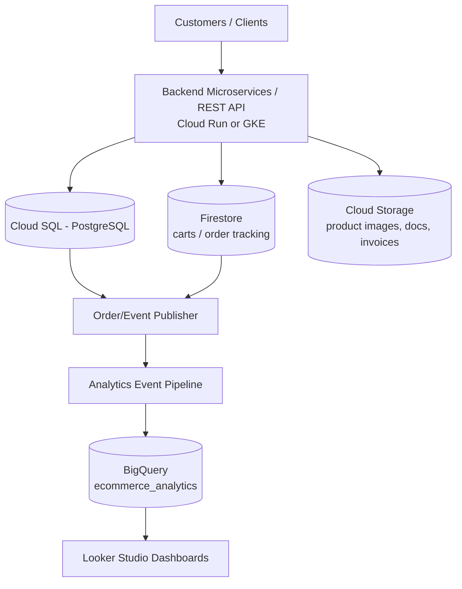

# Architecture

## Components

- **Backend API** (`src/`): Express/TypeScript REST API for vendors,
  products, carts, orders, tracking, and signed uploads.
- **PostgreSQL / Cloud SQL**: System of record for vendors, products,
  orders, and order items. Order creation is fully transactional.
- **Firestore**: Live shopping carts (`carts/{userId}`) and order tracking
  (`order_tracking/{orderId}`).
- **Cloud Storage**: Direct-to-bucket uploads via v4 signed URLs for
  product images, seller verification documents, and generated invoices.
- **BigQuery**: Analytics warehouse (`ecommerce_analytics`) fed by the
  Order/Event Publisher (see `src/services/analyticsPublisher.ts`).
- **Looker Studio**: Dashboards built on BigQuery views (see
  `analytics/looker-studio.md`).

## Deployment targets

- **Cloud Run**: Stateless container deployment, see `infra/cloud-run/`.
- **GKE**: Deployment + Service + HorizontalPodAutoscaler, see `infra/k8s/`.

See `docs/gcp-deployment.md` for what is fully implemented vs. what
requires additional GCP infrastructure wiring.
